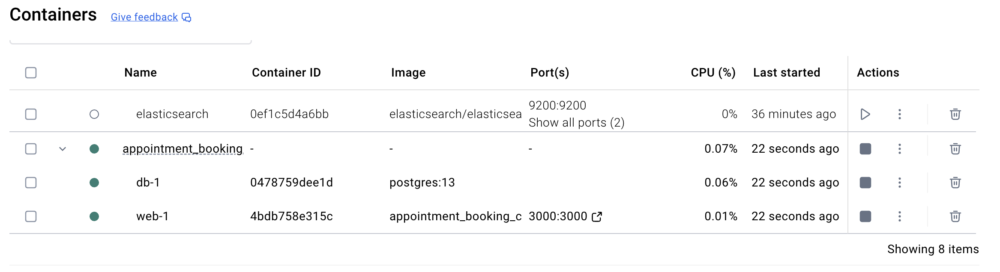
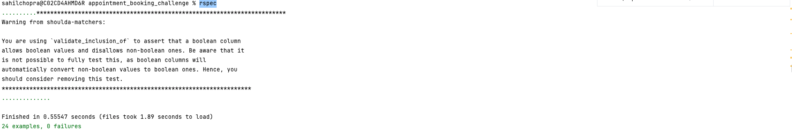
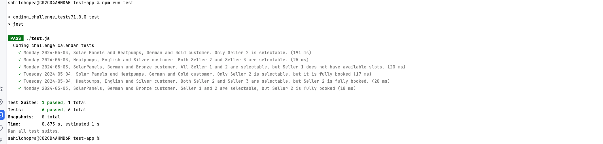

# Appointment Booking Challenge

We want to build an appointment booking system that allows customers to schedule appointments with our sales managers to discuss
one or more of our products. For the MVP, we will have a website that displays available appointment slots that a customer can choose
from.

The goal of this project is to implement the backend for this system. We need an endpoint that returns the available appointment slots
for a customer.

There are a few rules we need to consider when checking for available appointment slots for a customer:

• Each slot corresponds to a one-hour appointment

• Slots can have overlapping time ranges. For example, it is possible to have the following three slots:

– 10:30 - 11:30

– 11:00 - 12:00

– 11:30 - 12:30

• A sales manager CANNOT be booked for two overlapping slots at the same time. For example, if a sales manger has a slot booked
at 10:30 - 11:30, then the 11:00 - 12:00 cannot be booked anymore.

• Customers are matched to sales managers based on specific criteria. A slot CANNOT be booked by a customer if the sales manager
does not match any of these three criteria:

– Language. Currently we have 2 possible languages: German, English

– Product(s) to discuss. Currently we have 2 possible products: SolarPanels, Heatpumps

– Internal customer rating. Currently we have 3 possible ratings: Gold, Silver, Bronze.

• Customers can book one appointment to discuss multiple products

## Requirements
Design and implement a REST endpoint in any language of your choice that:

• Listens for POST requests on this route: http://localhost:3000/calendar/query
• Connects to the provided Postgres database instance
• Receives a request body in this format:
```
{
"date": "2024-05-03",
"products": ["SolarPanels", "Heatpumps"],
"language": "German",
"rating": "Gold"
}
```
• Returns a response with an array of available slots that can be booked by the customer in this format
```json
[
{
"available_count": 1,
"start_date": "2024-05-03T10:30:00.00Z"
},
{
"available_count": 2,
"start_date": "2024-05-03T12:00:00.00Z"
}
]
```

- We provide you with a docker database already populated with data. You are not allowed to modify the database structure of the
database in any way but you can create indexes or views if you think it is necessary. The docker database can be downloaded
here: https://enpalcorepgtechiv.blob.core.windows.net/tech-interview/backend/20241028_34f4060c/Take_Home_Challenge_
Resources.zip


# Installation and Setup
1. Clone the repository
2. cd appointment_booking_challenge
3. Run `docker-compose up --build` to start the application
   (It will take some time to build the application and start postgres with some seed data)



Make sure you have docker installed on your machine.

## API Endpoints
1. POST /calendar/query  - This endpoint returns available appointment slots  https://github.com/sahilchopra/appointment_booking_challenge/blob/main/config/routes.rb#L10

## Seed Data
Seed data is already present in the database. You can check the seed data in the seeds.rb file. https://github.com/sahilchopra/appointment_booking_challenge/blob/main/db/seeds.rb

## Test cases
all the tests are present in the spec folder. You can run the test cases using the below command
`docker-compose run web rspec`
https://github.com/sahilchopra/appointment_booking_challenge/tree/main/spec
- currently we have 24 test cases to validate logic


## How to run External Test Cases
- download https://enpalcorepgtechiv.blob.core.windows.net/tech-interview/backend/20241028_34f4060c/Take_Home_Challenge_Resources.zip
- Extract the zip file
- cd test-app folder
- Run `npm install`
- Run `npm run test`
- You will see the output of the test cases
- please make sure the application is running before running the test cases 


